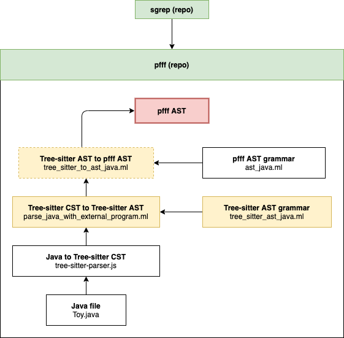
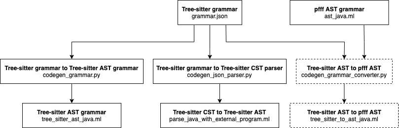

# Contributing

## Overview

This directory houses the files used for converting `tree-sitter` grammar to `pfff` grammar. 

## Background

At the moment, sgrep relies on pfff grammar rules for parsing files. In order to include more languages, we wanted to explore external parsers. Many parsers were difficult to integrate (used Docker to call API, needed Gradle/Maven) so we settled on [tree-sitter](https://github.com/tree-sitter/tree-sitter), a parsing library used by GitHub. We can call the tree-sitter API to run the parser on a file of a particular language. 

## Parsing AST Goal



We want to have the following components working for a fully-functional polyglot parser to integrate into sgrep:
- `parse_java_with_external_program.ml`: takes a `.java` file and returns a `.json` file, then runs a parser over the `.json` file to construct a `Tree_sitter_ast_java.ast` type object 
- `tree_sitter_ast_java.ml`: defines a grammar based on the `grammar.js`/`grammar.json` from `tree-sitter-java` 
- `tree_sitter_to_ast_java.ml`: (does not exist yet) converts the `Tree_sitter_ast_java.ast` type object to a `Ast_java.ast` type object

Ideally, the first two files will be auto-generated from the `grammar.json` file from `tree-sitter-java`.

## Code Generators Goal



We want to have the following auto-generators:
- `codegen_grammar.py`: This generates OCaml code based on the `grammar.json` from `tree-sitter-java`. It creates `tree_sitter_ast_java.ml`, the file containing the OCaml rules for creating the tree-sitter AST object. 
- `codegen_grammar_converter.py`: This generates OCaml code based on the `grammar.json` from `tree-sitter-java`. It creates `tree_sitter_to_ast_java.ml`, the file that converts the tree-sitter AST to the pfff AST. 
- `codegen_json_parser.py`: This generates OCaml code based on the `grammar.json` from `tree-sitter-java`. It creates `parse_java_with_external_program.ml`, the file that parses a `.java` file and creates a tree-sitter AST. 

## Current State

We have the following components:
- `tree_sitter_ast_java.ml`: This is a mostly auto-generated, but manually refined AST grammar file. It has been partially checked against `grammar.json`, but could use some more edits. 
- `parse_java_with_external_program.ml`: This currently generates an `Ast_java.ast` object from a toy `.java` program, but uses very few types for generating the object. 
- `test_java_parsing`: This contains a command-line function for testing `parse_java_with_external_program.ml`
- `tree-sitter-parser.js`: This can be run to generate a JSON string containing the `tree-sitter-java` CST 

We have the following auto-generators:
- `codegen_node.py`: This generates OCaml code that mostly (~95%) compiles, based on the `node-types.json` from `tree-sitter-java`. Unfortunately, `node-types.json` does not contain the full grammar necessary for parsing.
- `codegen_grammar.py`: This generates OCaml code that partially (~60%) compiles, based on the `grammar.json` from `tree-sitter-java`. The grammar rules are more accurate, but this needs some work to recursively generate the code correctly. 
- `codegen_json_parser.py`: This does not generate usable OCaml code at the moment, but parses the code similar to the logic used in `codegen_grammar.py` 

## Todos
- [ ] Improve `codegen_grammar.py`
- [ ] Improve/rewrite `codegen_json_parser.py` 
- [ ] Add grammar rules to `parse_java_with_external_program.ml` or with `codegen_json_parser.py` when it's ready 
- [ ] Check `tree_sitter_ast_java.ml` against `grammar.json` to ensure that it is as accurate as possible 
- [ ] Write `tree_sitter_to_ast_java.ml`
- [ ] Integrate with sgrep
- [ ] Write a corpus of grammar tests 
- [ ] Fix the way the `parse_java_with_external_program.ml` iterates through lists (use recursive pattern)

Something like (comment inserted for print statement template code, may be helpful):
```
let rec a_type = function
| J.Object [
"type", J.String "a_type";
"startPosition", _;
"endPosition", _;
"children", J.Array xs;
] ->
    let items, rest = 
        match xs with 
        | J.Object ["type", J.String "some_type"; "startPosition", _; "endPosition", _; "children", i;]::rest -> Some (qualified_ident i), rest
        | J.Object i::rest -> a_type rest
        | [] -> None, xs
        (* let _ = pr2 (spf "json: %s" (Json_io.string_of_json (J.Array rest))) *)
        in
        { 
            somefield: items;
            otherfield: block rest; 
        }
| x -> error "a_type" x
```

## Useful Links
[AST Discrepancies](https://github.com/returntocorp/pfff/pull/11)